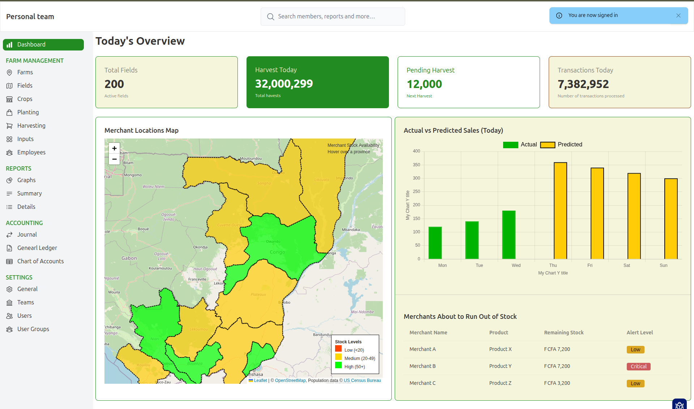

# Ash Phoenix Application Starter Kit

A starter Kit that helps you build what's unique to your application faster. 

Don't reinvent the wheel for common features. Clone it, rename it and start shipping with confidence. 

Built for fast prototype and scaling in the future.

You can find concepts used in this kit in the [Ash Framework for Phoenix Developers](https://medium.com/@lambert.kamaro/ash-framework-for-phoenix-developpers-c29b0a147552) blog serie. I will continue to add features and documentation as time permits. 

## FEATURES

1. Multitenancy with Team Management
2. Team switching
3. User invite to the team
4. Team user group permission management with Ash Policies
5. Permission management
6. Main Menu configurations
7. Chart Reports
8. Map Reports
11. Authentication with Ash Authentication
12. Templating with Daisy UI
14. Accounting with AshDouble Entry

### On-going implementation

###### User Impersonation

1. Super user is added to the `super_users` list in the config/config.exs  
2. Super users can go to Settings > Users > and see Impersonate button
3. If clicked, super users access the application as if they are the user they are impersonating
4. Super Users can Go back to their account by clicking on top right menu and select "Go Back to My Account"

### Upcoming features

1. Email send out
2. Rich Background Jobs with Oban
4. AI integration with Ash AI
5. Paper trail with Ash Paper Trail
6. Workflows with ash_approver(A local package that needs to be published)
7. Self referencing data with AshParental
8. Documentations
9. Automated CI/ CD workflow with Github

## Installation 

1. Clone this repository or use it as a template for your new app
2. Run `mix rename Samba MyNewProjectName` to rename your Phoenix App
3. Replace `Samba` with `MyNewProjectName` everywhere else in the code base
4. Run `mix tailwind.install` to install tailwindcss
5. Confirm that all is well with `mix tests`
6. Start implementing your new features

To start your Phoenix server:

* Run `mix setup` to install and setup dependencies
* Start Phoenix endpoint with `mix phx.server` or inside IEx with `iex -S mix phx.server`

Now you can visit [`localhost:4000`](http://localhost:4000) from your browser.

Ready to run in production? Please [check our deployment guides](https://hexdocs.pm/phoenix/deployment.html).

## Learn more

### Phoenix
* https://www.phoenixframework.org/
* https://hexdocs.pm/phoenix/overview.html
* Forum: https://elixirforum.com/c/phoenix-forum

### Ash
* https://ash-hq.org/
* https://hexdocs.pm/ash/readme.html
* https://elixirforum.com/c/ash-framework-forum/
